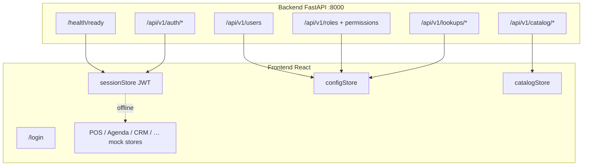

# Backend handoff — Jean Paul

> Documento histórico. Para el estado vigente de producción consulta
> [RAILWAY_RUNBOOK.md](./RAILWAY_RUNBOOK.md) y [PRODUCTION_BACKLOG.md](./PRODUCTION_BACKLOG.md).

This document is for **Jean Paul**, who owns the backend. It explains what exists today after merging `main`’s API into the `full-stack` branch, how the React frontend talks to it, what is still mock-only, and what CRUDs you need to build next.

---

## 1. Big picture

| Layer | Status |
|-------|--------|
| **Frontend** | React + Vite on port **3000** (`frontend/`). Most modules (POS, Agenda, CRM, Finanzas, RRHH…) still use **Zustand + local mock data**. |
| **Backend** | FastAPI + PostgreSQL on port **8000** (`backend/`). Real APIs for **IAM** (auth, users, roles/permissions) and **Catalog** (categories, products identity). |
| **Connection** | **Hybrid**: if `GET /health/ready` succeeds → login required (JWT). If API is down → app keeps working with demo user `CURRENT_USER` and mock stores. |



**Proxy (dev):** Vite maps `/api-backend` → `http://127.0.0.1:8000` (see `frontend/vite.config.js`).  
**Env:** `VITE_API_BASE_URL=/api-backend` in `frontend/env.example`.

---

## 2. Your local setup (first day)

From repo root:

```bash
cd backend
cp .env.example .env
# Edit .env: set LOCAL_BOOTSTRAP_ADMIN_PASSWORD and JWT_SECRET_KEY (32+ chars)

docker compose up -d          # Postgres on localhost:5433
pip install -r requirements.txt
alembic upgrade head
python -m app.scripts.bootstrap_local
python -m app.scripts.seed_local_demo   # optional demo users *.demo@erp.dev

uvicorn app.main:app --reload --port 8000
```

Second terminal:

```bash
cd frontend
cp env.example .env
yarn install && yarn dev      # http://localhost:3000
```

Login: **`owner@erp.dev`** (password from `LOCAL_BOOTSTRAP_ADMIN_PASSWORD` in `backend/.env`).

**CORS:** `backend/.env.example` includes `http://localhost:3000` and `http://127.0.0.1:3000` for this frontend.

**Docs you own (source of truth):**

| File | Content |
|------|---------|
| `docs/backend/GLOBAL.md` | Architecture, errors, migrations, conventions |
| `docs/backend/IAM_API.md` | Auth, users, roles, permissions |
| `docs/backend/CATALOG_API.md` | Categories, products (identity only) |
| `docs/backend/MASTER_DATA_API.md` | Customers, basic employees, schedules, attachments |
| `docs/backend/FOUNDATION_SCHEMA.md` | Workspace / branch / legal entity model |
| `backend/README.md` | Runbook, bootstrap, tests |

**Tests:** `cd backend && pytest` (needs Postgres). CI: `.github/workflows/backend-ci.yml`.

---

## 3. API conventions the frontend already expects

1. **JSON field names:** `camelCase` (Pydantic `ApiModel` with alias generator).
2. **Errors:** `{ "message": "…", "parameter": "optionalField" }`.
3. **Auth:** `Authorization: Bearer <accessToken>`.
4. **Refresh:** `POST /api/v1/auth/refresh` with `{ "refreshToken": "…" }`. On 401, frontend retries once then clears session.
5. **Pagination:** `page`, `pageSize`, `totalItems`, `totalPages` on list endpoints.
6. **Optimistic concurrency:** `version` required on PATCH for categories and products.

Frontend client code:

| Path | Role |
|------|------|
| `frontend/src/services/apiClient.js` | Fetch wrapper, token attach, refresh |
| `frontend/src/services/authApi.js` | login, refresh, logout, me |
| `frontend/src/services/usersApi.js` | users list/summary/form-options/create |
| `frontend/src/services/permissionsApi.js` | roles, matrix, PUT permissions |
| `frontend/src/services/catalogApi.js` | categories + products CRUD |
| `frontend/src/services/lookupsApi.js` | roles/branches dropdowns |
| `frontend/src/services/adapters/iam.js` | API → UI user shapes |
| `frontend/src/services/adapters/catalog.js` | API → UI category shapes |
| `frontend/src/lib/catalogSync.js` | Merge API products with local price/stock/type |

---

## 4. What is implemented on the backend (today)

### 4.1 Health

| Method | Route | Used by |
|--------|-------|---------|
| GET | `/health` | Liveness |
| GET | `/health/ready` | `sessionStore.bootstrap()` — decides online vs offline |

### 4.2 Authentication (IAM)

| Method | Route | Frontend |
|--------|-------|----------|
| POST | `/api/v1/auth/login` | `LoginPage` |
| POST | `/api/v1/auth/refresh` | `apiClient` on 401 |
| POST | `/api/v1/auth/logout` | `UserProfileMenu` |
| GET | `/api/v1/auth/me` | Session bootstrap after login |

**Gap:** `/me` does not return `role` name. Navbar shows `"Miembro"` until we add role to the session response (recommended).

### 4.3 Users

| Method | Route | Frontend page | Notes |
|--------|-------|---------------|-------|
| GET | `/api/v1/users` | `UsuariosPage` | List + search when online |
| GET | `/api/v1/users/summary` | `UsuariosPage` | KPI cards |
| GET | `/api/v1/users/form-options` | `UsuariosPage` | Role + branch pickers on create |
| POST | `/api/v1/users` | `UsuariosPage` | Create only |

**Missing (frontend still needs these):**

| Needed | Why |
|--------|-----|
| `PATCH /api/v1/users/{membershipId}` | Edit name, email, role, branches, active/inactive |
| `POST /api/v1/users/{id}/reset-password` or similar | Admin reset; profile change-password when online |
| `DELETE` or deactivate endpoint | Remove/deactivate user from UI |
| Filter by branch in list | UI has branch filter; ensure `branchId` query works with frontend branch UUIDs |

### 4.4 Roles & permissions

| Method | Route | Frontend page |
|--------|-------|---------------|
| GET | `/api/v1/roles` | Available, not wired to local role chips yet |
| GET | `/api/v1/roles/summary` | Available |
| GET | `/api/v1/permissions/matrix` | `PermisosPage` (IAM section when online) |
| PUT | `/api/v1/roles/{roleId}/permissions` | `PermisosPage` save |

**Important:** Backend permissions are **codes** (`membership.read`, `catalog.manage`, …) grouped in modules (`foundation`, `iam`, `catalog`, `crm`, `hr`).
Frontend **also** has a separate **local-only** matrix in `frontend/src/data/permisos.js` for transactional modules that have not migrated yet. Customers and basic employees already use the Phase 2 API; preserve the remaining demo gates until each domain has a real backend.

### 4.5 Lookups

| Method | Route | Frontend |
|--------|-------|----------|
| GET | `/api/v1/lookups/roles` | Available |
| GET | `/api/v1/lookups/branches` | User form + catalog product branch mapping |

**Gap:** `SucursalesPage` still edits **local** branches (`charm-dn`, `charm-santiago`, …). API branches are UUIDs from bootstrap (`Sucursal Norte`, etc.). There is **no branch CRUD API** yet. Frontend maps by **name** when possible (`catalogSync.resolveApiBranchIds`).

### 4.6 Catalog

| Method | Route | Frontend |
|--------|-------|----------|
| GET/POST/PATCH | `/api/v1/catalog/categories` | `CategoriasPage` when online |
| GET/POST/PATCH | `/api/v1/catalog/products` | `InventariosPage` / `ProductFormModal` when online |
| GET | `/api/v1/catalog/units-of-measure` | Product create/update |

**Hybrid product model (critical):**

The API product has: `name`, `sku`, `categoryId`, `unitOfMeasureId`, `branchIds`, `status`, `version`.

The frontend **still stores locally** (not in API): `price`, `cost`, `stock`, `type` (product/service/supply), `taxPct`, `minStock`, `allowNegativeStock`, etc.

Flow in `catalogStore.hydrateFromApi()`:

1. Fetch API products.
2. Match local rows by **SKU**, then **name**.
3. Keep local commercial/inventory fields; take identity from API.
4. Local-only rows (e.g. services with no API match) stay for POS.

When online, create/update calls API first, then updates local store (`catalogStore.saveProduct`).

**Missing on catalog (high value for Jean Paul):**

| Field / feature | Used in UI | Suggested API home |
|-----------------|------------|-------------------|
| `price`, `cost`, `taxPct` | POS, Inventarios | Extend `Product` or `ProductPricing` table |
| `stock`, `minStock`, movements | Inventarios, POS decrement | Inventory module + stock ledger |
| `type` (product/service/supply) | POS sellable rules | Catalog `productKind` enum |
| Product delete / archive from UI | Inventarios | PATCH `status=archived` (exists) — wire delete button |
| Category `type`, `color` | Categorias cards | Optional UI-only or extend category schema |

---

## 5. Module map — what connects to what

### Wired to API (when backend is up)

| Frontend module | Route | Backend endpoints | Store / files |
|-----------------|-------|-------------------|---------------|
| **Login** | `/login` | `auth/*` | `sessionStore.js` |
| **Usuarios** | `/configuracion/usuarios` | `users/*`, `lookups/*` | `UsuariosPage.jsx` |
| **Permisos (IAM)** | `/configuracion/permisos` | `permissions/matrix`, `roles/{id}/permissions` | `PermisosPage.jsx` + local `permisos.js` overlay |
| **Categorías** | `/configuracion/categorias` | `catalog/categories` | `CategoriasPage.jsx`, `configStore` |
| **Inventarios / productos** | `/inventarios` | `catalog/products`, `units-of-measure`, `lookups/branches` | `catalogStore.js`, `ProductFormModal.jsx` |

### Still 100% mock (no backend yet)

| Frontend module | Routes | Mock data / store | Future backend domain |
|-----------------|--------|-------------------|------------------------|
| **Dashboard** | `/dashboard` | `data/dashboard.js` | Analytics / aggregates |
| **POS** | `/pos`, `/pos/caja`, `/pos/cuentas-por-cobrar` | `posStore.js` | Sales, payments, CxC |
| **Agenda** | `/agenda/*` | `agendaStore.js` | Appointments (`appointments` module planned in bootstrap) |
| **CRM** | `/crm/*` | CRM stores + seed data | CRM module (planned) |
| **Finanzas** | `/finanzas/*` | finanzas stores | Accounting |
| **Compras** | `/compras` | local | Purchasing |
| **RRHH** | `/rrhh/*` | `data/rrhh.js`, stores | HR / payroll |
| **Reportes** | `/reportes/*` | agenda + mock reports | Reporting APIs |
| **Sucursales** | `/configuracion/sucursales` | `configStore.branches` | `branch.manage` — **needs CRUD** |
| **Métodos de pago** | `/configuracion/metodos-pago` | `configStore` | Payments config |
| **Plantillas WA** | `/configuracion?open=whatsapp` | `whatsappTemplates.js` | Notifications / templates |
| **Incidencias** | `/incidencias` | local | Support tickets |

---

## 6. CRUD checklist — what to build (priority order)

Use this as your backlog. “Frontend ready” means the UI exists but uses mocks until the API exists.

### P0 — Unblock current wired screens

- [ ] **`GET /api/v1/auth/me`**: include `role` (name + id) and visible `branches`.
- [ ] **`PATCH /api/v1/users/{membershipId}`**: update display name, role, branch assignments, status.
- [ ] **Branch read API for all authenticated users** (not only `membership.manage`) so branch filters work outside user admin.
- [ ] **Align bootstrap branches** with customer naming OR document mapping (today: demo branches vs Charm DN/Santiago/Este in UI).

### P1 — Catalog completeness (POS depends on this)

- [ ] **Pricing on product**: `price`, `cost`, `taxRate` (or link to tax table).
- [ ] **Product kind**: `product | service | supply` (matches `catalogStore` `type`).
- [ ] **Stock balance + adjustments** per branch (or warehouse): `GET` stock, `POST` adjustment.
- [ ] **DELETE / archive product** from inventarios (PATCH archived already exists).

### P2 — Foundation / config

- [ ] **Branch CRUD** (`branch.manage`): wires `SucursalesPage`.
- [ ] **Legal entity / workspace settings**: wires business name, RNC, tax default in `configStore.settings`.
- [ ] **Payment methods** CRUD (if persisted server-side).

### P3 — Core business domains (large slices)

- [ ] **Appointments** — Agenda calendar, gestión citas, reporte agenda, CxC sync from agenda.
- [ ] **Sales / POS** — cart, sales, cash drawer, receivables (`posStore`, `CxcPage`).
- [ ] **CRM** — clients, leads, pipeline (`crm/*`).
- [ ] **Customers** shared between CRM, Agenda customer picker, POS.

Each new domain should follow the same layout as IAM/Catalog: `router` → `schemas` → `services` → `repositories` → Alembic migration → tests → doc in `docs/backend/`.

### P4 — Later

- Finanzas, RRHH, Compras, Reportes exports, WhatsApp template storage, audit UI for agenda.

---

## 7. Security & permissions you should preserve

- Permissions are **stable codes** (`membership.read`, `catalog.manage`, …), not UI labels.
- Every protected route revalidates membership, session, and grants (see `IAM_API.md`).
- `role.manage` is workspace-wide; branch-scoped users cannot escalate.
- Admin role must keep minimum IAM grants (enforced in `permissions.py` service).
- Never return stack traces; use `{ message, parameter }`.
- Production: real `JWT_SECRET_KEY`, TLS, rate limiting on login.

When you add a module, register permissions in bootstrap (`local_bootstrap.py` pattern) and expose them in `GET /api/v1/permissions/matrix`.

---

## 8. How frontend decides online vs offline

1. App boot → `sessionStore.bootstrap()` in `App.jsx`.
2. `GET /health/ready` (no auth).
3. **Fail** → `status: 'offline'`, no login gate, `CURRENT_USER` from `frontend/src/data/dashboard.js`.
4. **OK** → `status: 'online'`, `AuthGate` redirects to `/login` if no valid token.
5. Token in `localStorage` key `diedo-session` (access + refresh only).

You can develop backend without frontend: Postman collection notes in `backend/postman/README.md`.

---

## 9. Suggested workflow for new endpoints

1. Read `docs/backend/GLOBAL.md` and add contract to `docs/backend/<MODULE>_API.md`.
2. Alembic migration + models in `backend/app/db/models/`.
3. Repository + service + router + schemas.
4. Tests in `backend/tests/test_<module>.py`.
5. Tell frontend which adapter fields to map (or keep camelCase consistent).
6. Run `pytest` and ensure CI passes.

**Do not** break existing camelCase JSON or the error envelope — the frontend client is already deployed in this branch.

---

## 10. Quick reference — implemented routes

```
GET  /health
GET  /health/ready

POST /api/v1/auth/login
POST /api/v1/auth/refresh
POST /api/v1/auth/logout
GET  /api/v1/auth/me

GET  /api/v1/users
GET  /api/v1/users/summary
GET  /api/v1/users/form-options
POST /api/v1/users

GET  /api/v1/roles
GET  /api/v1/roles/summary
PUT  /api/v1/roles/{roleId}/permissions

GET  /api/v1/permissions/matrix

GET  /api/v1/lookups/roles
GET  /api/v1/lookups/branches

GET    /api/v1/catalog/categories
POST   /api/v1/catalog/categories
GET    /api/v1/catalog/categories/{id}
PATCH  /api/v1/catalog/categories/{id}

GET    /api/v1/catalog/products
POST   /api/v1/catalog/products
GET    /api/v1/catalog/products/{id}
PATCH  /api/v1/catalog/products/{id}

GET  /api/v1/catalog/units-of-measure
```

---

## 11. Questions / contact

If something in the frontend does not match this doc, check:

- `frontend/src/services/*.js` — actual HTTP calls
- `frontend/src/stores/sessionStore.js` — auth flow
- This file and `docs/backend/*.md`

When in doubt, extend the API with **versioned PATCH** and **stable permission codes** rather than ad-hoc fields per screen.

---

*Last updated: branch `full-stack` — merge of `main` backend + React frontend integration.*
