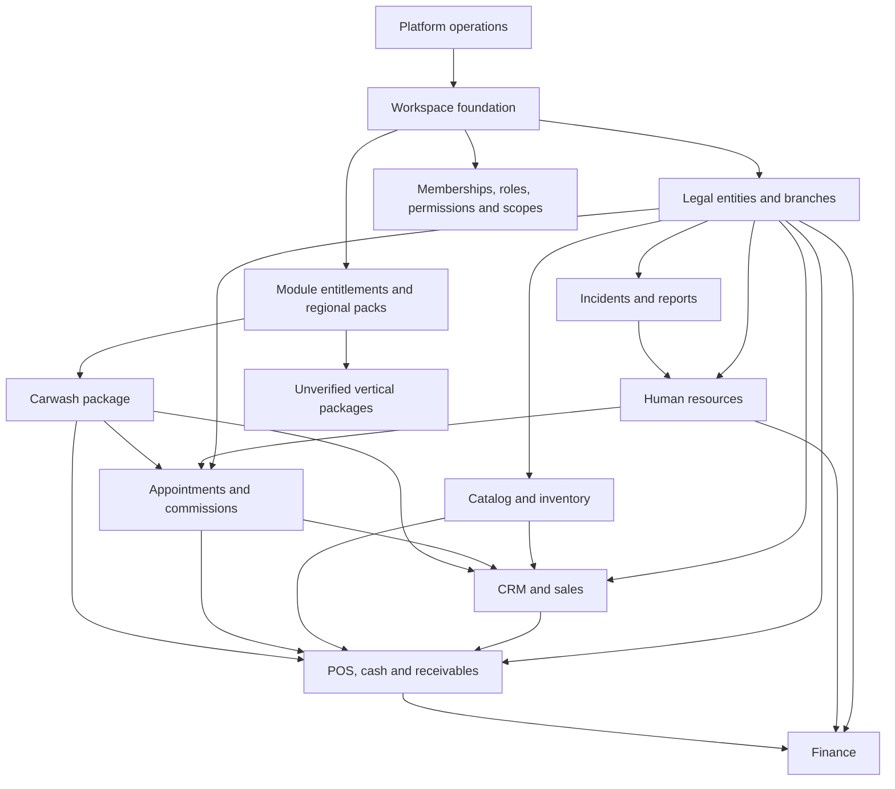

# ERP/CRM domain knowledge base

This vault captures the business capabilities observed in the legacy DiedoApp production UI and
turns them into a proposed, multi-company SaaS domain model. It is intentionally independent from
the legacy implementation technology.

> [!warning] Production evidence policy
> The legacy application is a read-only evidence source. No records may be created, edited,
> approved, paid, closed, imported, exported, or deleted during discovery. Production personal and
> financial data must never be copied into this vault.

## How to read this vault

Every business statement uses one of these evidence labels:

- **Observed**: directly visible in an accessible production screen or blank, unsubmitted form.
- **Inferred**: supported by navigation, labels, or the compiled client bundle, but not exercised.
- **Proposed**: recommended behavior for the replacement product.
- **Gap**: insufficient or contradictory evidence; validation is required before implementation.

Start with:

- [[methodology]]
- [[glossary]]
- [[decision-log]]
- [[coverage-matrix]]
- [[gap-register]]

## Capability map

## Domain notes

### SaaS foundation

- [[saas-foundation]]
- [[access-control]]
- [[dominican-republic-pack]]

### Core ERP/CRM

- [[crm-and-sales]]
- [[pos-cash-and-receivables]]
- [[appointments-and-commissions]]
- [[catalog-and-inventory]]
- [[human-resources]]
- [[finance]]
- [[incidents-and-reports]]

### Optional packages

- [[carwash-package]]
- [[unverified-verticals]]

### Cross-domain model

- [[cross-domain-flows]]
- [[logical-data-model]]
- [[data-dictionary]]
- [[database-handoff]]

## Current delivery boundary

This delivery defines business logic and a logical data model. It does **not** add FastAPI routes,
public API schemas, SQLAlchemy mappings, Alembic migrations, or physical database indexes.

