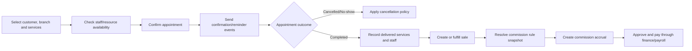
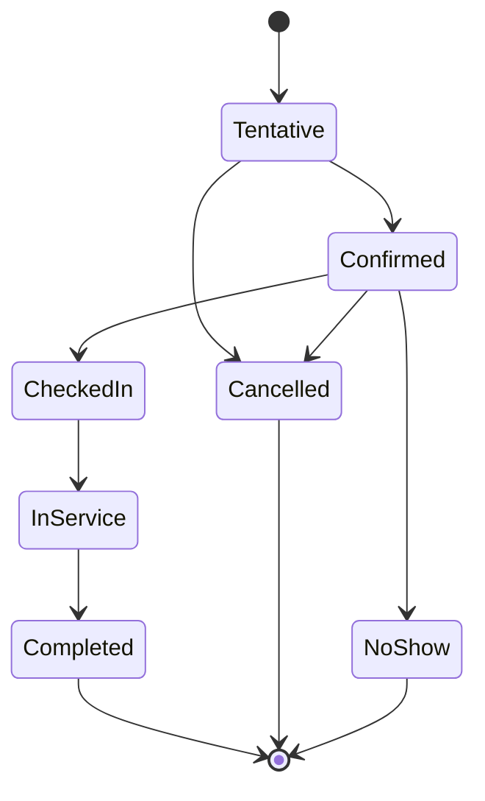

# Appointments and commissions

## Evidence

- **Observed** — `/agenda` provides day, week, month, cancelled, schedule, and multi-appointment
  views across branches.
- **Observed** — `/agenda/gestion` exposes customer/service search, date/time, branch/cabin, assigned
  employee, state, and actions.
- **Observed** — `/configuracion/agenda` configures cabin/resource order and agenda personnel per
  branch.
- **Observed** — WhatsApp templates cover appointment reminder and confirmation messages.
- **Observed** — `/comisiones` derives commissions from completed services and separates total,
  paid, and pending amounts.
- **Observed** — commission rules can use a percentage or fixed value for an employee/service pair.

## Actors and permissions

Scheduler, service employee, supervisor, customer, commission administrator, payroll/finance clerk,
and notification worker. Permissions separate appointment view/create/reschedule/cancel/complete,
resource configuration, commission rule management, commission approval, and commission payment.

## Core rules

| Rule | Evidence | Behavior |
|---|---|---|
| AGENDA-RULE-001 | Proposed | An appointment belongs to one branch and one branch-local time zone. |
| AGENDA-RULE-002 | Proposed | An appointment contains one customer, one or more services, scheduled intervals, assigned staff, and optional resources. |
| AGENDA-RULE-003 | Proposed | Staff and resource conflicts are checked against active intervals and branch availability before confirmation. |
| AGENDA-RULE-004 | Proposed | Rescheduling preserves history and reruns availability, notification, and deposit policies. |
| AGENDA-RULE-005 | Proposed | Cancellation records actor, reason, timestamp, and any fee/refund decision. |
| AGENDA-RULE-006 | Proposed | Completion requires delivered-service quantities and responsible employees; it may create a sale draft or fulfill an existing sale. |
| AGENDA-RULE-007 | Proposed | Notification delivery is separate from appointment state and is idempotent by appointment/template/channel/event. |
| COMM-RULE-001 | Observed/Proposed | A commission rule is effective-dated and resolves by employee, service/item, branch, and optional role. |
| COMM-RULE-002 | Proposed | A commission accrual is created from an eligible completed service/sale snapshot, not recalculated from the current rule. |
| COMM-RULE-003 | Proposed | Accrued, approved, paid, reversed, and disputed amounts are distinct states and events. |
| COMM-RULE-004 | Proposed | Cancelling/refunding an eligible service creates a reversal; it does not delete the original accrual. |

## Service-to-commission flow

## Proposed appointment lifecycle

The legacy UI exposed cancellation and generic status filtering but not the complete enum; this
lifecycle remains **Proposed** until validated.

## Calculations

- Percentage commission = eligible net base x snapshotted rate.
- Fixed commission = snapshotted fixed amount x eligible delivered quantity when the configured rule
  declares per-unit behavior.
- Tax, tips, discounts, refunds, and shared-service allocation must be explicitly included or excluded
  by rule; no implicit base is assumed.
- Pending commission = approved accruals minus payment allocations and reversals.

## Entities and effects

`Appointment`, `AppointmentService`, `AppointmentStatusHistory`, `AppointmentAssignment`,
`AvailabilityRule`, `ScheduleException`, `Resource`, `ResourceBooking`, `NotificationTemplate`,
`NotificationAttempt`, `CommissionRule`, `CommissionAccrual`, `CommissionAdjustment`, and
`CommissionPaymentAllocation`.

Effects: completion can create sales, inventory consumption, customer history, commissions, employee
performance metrics, and finance events.

## Gaps

- Full appointment states, recurrence, deposits, cancellation/no-show fees, waitlist, and time-buffer
  rules were not observable.
- Resource capacity and multi-employee service semantics were not visible.
- Commission base, approval, dispute, reversal, and payroll integration rules require validation.

