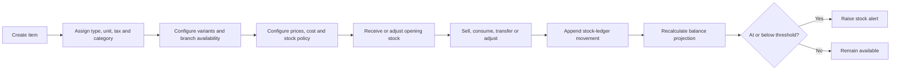
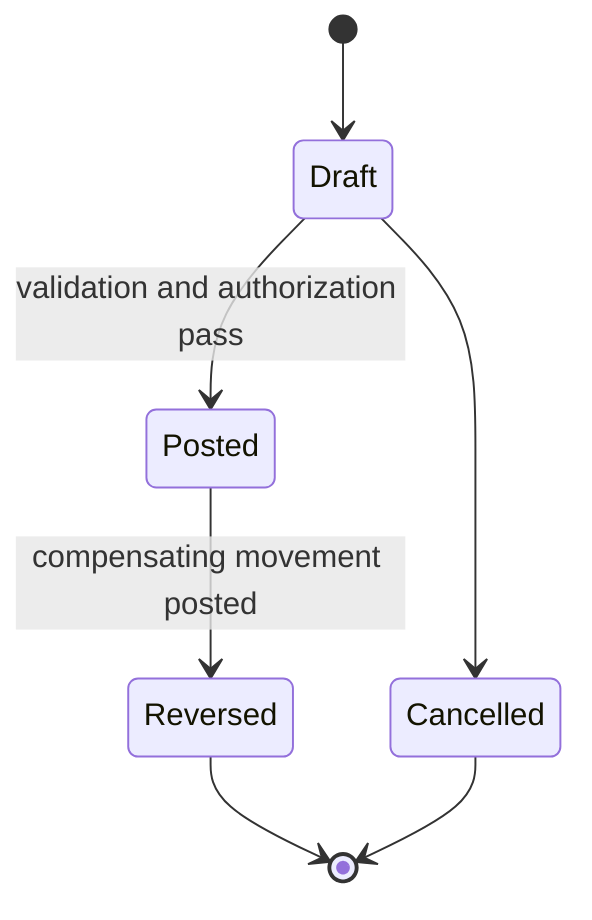

# Catalog and inventory

## Evidence

- **Observed** — the item form supports product/service type, usage subtype, category, SKU, sale
  price, acquisition cost, item-level ITBIS, sizes, current/minimum stock, membership flag, branch
  availability, unit of measure, dynamic pricing, negative stock, and image.
- **Observed** — `/inventarios` provides Product, Asset, and Movement tabs, branch filtering,
  low/out-of-stock metrics, multiple issue, and catalog management.
- **Observed** — inventory reporting compares current cost value, estimated sale value, sold quantity,
  revenue, and estimated profit.

## Actors and permissions

Catalog manager, inventory clerk, branch manager, purchaser, seller, stock-adjustment approver, and
report viewer. Price edit, cost view, negative-stock override, transfer, and adjustment are separate
permissions.

## Core rules

| Rule | Evidence | Behavior |
|---|---|---|
| CATALOG-RULE-001 | Proposed | An item is workspace-owned and classified as product, service, membership, asset template, or other explicit type. |
| CATALOG-RULE-002 | Proposed | Branch availability, price, tax category, and stock policy are effective-dated assignments, not duplicated items. |
| CATALOG-RULE-003 | Proposed | SKU/catalog code uniqueness is scoped by workspace and code namespace; missing codes are allowed only for item types that do not require operational scanning. |
| CATALOG-RULE-004 | Proposed | Dynamic price authorizes a controlled sale-time override but preserves default and applied price snapshots. |
| CATALOG-RULE-005 | Proposed | Size/variant tracking uses item variants; total stock is derived from variant/location balances. |
| INVENTORY-RULE-001 | Proposed | Stock truth is an append-only ledger of movements; a mutable quantity is only a projection/cache. |
| INVENTORY-RULE-002 | Proposed | Every movement has workspace, branch/location, item/variant, quantity, unit, reason, source reference, actor, and timestamp. |
| INVENTORY-RULE-003 | Proposed | A movement cannot cross workspaces or incompatible units. |
| INVENTORY-RULE-004 | Proposed | Transfers create paired source/destination legs under one transfer aggregate. |
| INVENTORY-RULE-005 | Proposed | Adjustments require a reason and permission; they never rewrite prior movements. |
| INVENTORY-RULE-006 | Observed/Proposed | Negative stock is item/branch policy plus actor authorization, and every override is audited. |
| INVENTORY-RULE-007 | Proposed | Low-stock alerts compare available quantity against the effective reorder threshold for one location/item/variant. |
| INVENTORY-RULE-008 | Proposed | Services do not create stock movements unless a recipe/bundle explicitly consumes component items. |
| INVENTORY-RULE-009 | Proposed | Membership items grant a versioned entitlement term; activity is not inferred solely from a recent payment. |

## Item-to-stock flow

## Inventory movement model

Confirmed movements are never edited. Corrections post a reversal and, when needed, a replacement.

## Calculations

- On-hand = posted inbound quantity - posted outbound quantity per item/variant/location.
- Reserved and available quantities are separate projections when reservations are enabled.
- Available = on-hand - reserved; negative availability follows explicit policy.
- Inventory value requires a selected valuation policy and must not be inferred from the current item
  cost alone.
- Estimated sale value and estimated profit are analytical projections, not accounting balances.

## Entities and effects

`Item`, `ItemVariant`, `ItemCategory`, `UnitOfMeasure`, `ItemBranchAssignment`, `PriceList`, `ItemPrice`,
`ItemCost`, `InventoryLocation`, `StockMovement`, `StockTransfer`, `StockReservation`, `StockBalance`,
`ReorderPolicy`, `StockAlert`, `BundleRecipe`, and `MembershipPlan`.

Effects: sales and completed services issue stock; purchasing/receiving increases stock; adjustments
feed audit/reporting; membership sales grant entitlements.

## Gaps and anomalies

- Purchase-order and receiving workflows were redirected and remain unverified.
- Valuation policy, lots/serials, expiration, warehouses, reservations, and unit conversion were not
  observed.
- Product, asset, and movement tab semantics were not fully available.
- Missing SKU and widespread low-stock records require data-quality rules; see [[gap-register]].

