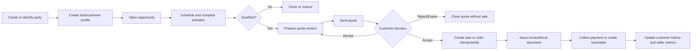
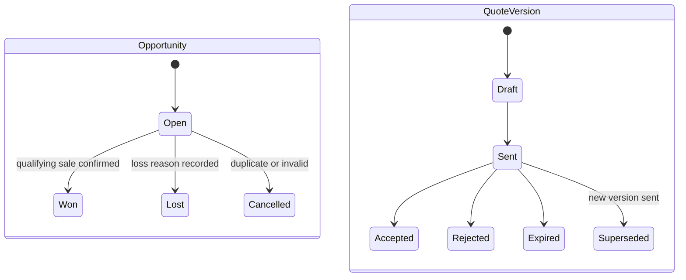

# CRM and sales

## Evidence

- **Observed** — `/crm/clientes` separates consumer and business customers and filters by status and
  branch.
- **Observed** — `/crm/pipeline` exposes opportunities, priority, branch, value, close-rate metrics,
  and a create action.
- **Observed** — `/crm/oportunidades-seguimiento` shows dated activities, activity types, completion,
  branches, opportunity stages, WhatsApp actions, and values.
- **Observed** — `/crm/cotizaciones` exposes Draft, Sent, Accepted, Rejected, and Expired filters.
- **Observed** — the blank quote form supports an optional source opportunity, customer identity,
  branch, items/services, quantity, fixed/percentage discount, validity, tax, notes, and conditions.
- **Observed** — `/crm/ventas` exposes invoices, fiscal documents, customer, branch, amount, payment
  status, seller, and Paid/Partial filters.

## Actors and permissions

Seller, sales manager, branch manager, quote approver, billing clerk, customer, and automated
follow-up worker. Permissions include view/create/edit customer, manage opportunity, manage activity,
create/revise/send/accept quote, confirm sale, issue invoice, and export authorized reports.

## Core rules

| Rule | Evidence | Behavior |
|---|---|---|
| CRM-RULE-001 | Proposed | A `Party` represents a person or organization once per workspace; commercial roles are separate profiles. |
| CRM-RULE-002 | Observed/Proposed | A customer can be consumer or business and may be associated with several branches without duplicating identity. |
| CRM-RULE-003 | Proposed | Lead qualification creates or activates a customer account without losing lead history. |
| CRM-RULE-004 | Proposed | An opportunity belongs to one workspace, customer/lead, owner, pipeline, current stage, and reporting currency; branch is optional until the sale requires one. |
| CRM-RULE-005 | Proposed | Opportunity stage changes append history with actor, timestamp, prior stage, new stage, and reason. |
| CRM-RULE-006 | Observed/Proposed | Activities have type, due date/time, description, assignee, completion state, and optional opportunity/customer links. |
| CRM-RULE-007 | Observed/Proposed | A quote may be created manually or from an opportunity; copied customer and item data becomes an editable draft snapshot. |
| CRM-RULE-008 | Proposed | Quote revisions are immutable versions under one quote series; sending a new version supersedes, but does not delete, prior versions. |
| CRM-RULE-009 | Proposed | Quote totals equal line subtotals minus line/document discounts plus taxes, using one rounding policy and the regional tax engine. |
| CRM-RULE-010 | Proposed | Only a non-expired sent quote version can be accepted; rejection and expiration require no sale mutation. |
| CRM-RULE-011 | Proposed | Accepting a quote can create a sales order/sale draft idempotently; it must not create duplicate sales on retry. |
| CRM-RULE-012 | Proposed | A sale and its invoice/payment state are separate. Payment status is derived from allocations, not manually overwritten. |
| CRM-RULE-013 | Proposed | Customer purchase history is a projection of confirmed sales, not a second transaction store. |
| CRM-RULE-014 | Proposed | Seller performance metrics define included sale states, returns, currency, date, branch scope, and attribution rule. |

## Lead-to-cash flow

## State models

Opportunity stage names inside `Open` are configurable per workspace. Proposal, Negotiation, and
Won were visible in legacy activity data, but the complete pipeline was not observable.

## Calculations

- Line subtotal = quantity x unit price.
- Discount supports fixed or percentage representation but is stored with its calculation basis and
  allocated deterministically to lines for tax/reporting.
- Tax is calculated per line using [[dominican-republic-pack]] or another active regional pack.
- Pipeline value includes only configured open stages and one reporting currency policy.
- Close rate defines numerator, denominator, and time window; cancelled/duplicate opportunities are
  not silently treated as losses.

## Entities and effects

`Party`, `PartyIdentifier`, `CustomerAccount`, `LeadProfile`, `PartyBranchAssociation`, `Pipeline`,
`PipelineStage`, `Opportunity`, `OpportunityStageHistory`, `CRMActivity`, `Quote`, `QuoteVersion`,
`QuoteLine`, `Sale`, `SaleLine`, `Invoice`, and `SellerAttribution`.

Effects: accepted quotes can create sales; confirmed sales request inventory and fiscal processing;
payments update receivables; completed sales feed customer history, finance, commissions, and reports.

## Gaps and anomalies

- **Gap** — full customer fields, duplicate detection, merge, consent, and ownership transfer were not
  observable.
- **Gap** — full configurable opportunity stages and allowed transition rules were not observable.
- **Gap** — quote acceptance authority and customer-facing acceptance mechanism were not visible.
- **Gap** — invoice void, return, refund, and credit-note workflows were inaccessible.
- See [[gap-register]] for inconsistent summary/detail metrics and quote/POS tax divergence.

