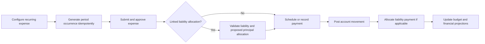
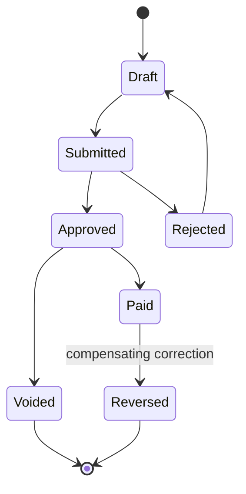

# Finance

## Evidence

- **Observed** — finance overview exposes income, expenses, monthly balance, quick P&L, budgets,
  liabilities, fixed expenses, and reports.
- **Observed** — expense entry includes category, optional budget, branch, description, amount, date,
  state, optional liability reduction, and receipt.
- **Observed** — fixed expenses have name, branch, amount, day of month, category, monthly pending/paid
  state, and a pay action.
- **Observed** — liabilities are branch-filtered and can be associated with expense categories for
  principal reduction.
- **Observed** — financial accounts include type, currency, name, bank, account number, balance, and
  notes.
- **Observed** — manual income includes category, branch, amount, date, customer, source, and state.
- **Observed** — payment methods map to income categories.

## Actors and permissions

Finance clerk, branch manager, budget owner, expense approver, treasury operator, liability manager,
accounting user, and auditor. Creating, approving, paying, reconciling, and reporting are distinct
permissions.

## Core rules

| Rule | Evidence | Behavior |
|---|---|---|
| FIN-RULE-001 | Proposed | Operational income/expense, payment tender, financial account movement, and accounting posting are separate concepts connected by references. |
| FIN-RULE-002 | Proposed | A money-bearing transaction stores amount and currency; workspace display preference never changes its denomination. |
| FIN-RULE-003 | Proposed | Manual income and expense require legal entity, branch when operationally relevant, category, date, source, and actor. |
| FIN-RULE-004 | Proposed | Expense lifecycle separates draft, submitted, approved, rejected, paid, voided, and reversed concerns; legacy generic status is insufficient. |
| FIN-RULE-005 | Proposed | Receipt attachments have content metadata, ownership, access classification, and malware/content validation at the future storage boundary. |
| FIN-RULE-006 | Proposed | A recurring expense definition generates idempotent period occurrences; paying an occurrence does not mutate the recurrence template. |
| FIN-RULE-007 | Proposed | A liability has principal, currency, lender, dates, terms, and an append-only allocation history. Expense category matching may suggest, but cannot silently perform, principal reduction. |
| FIN-RULE-008 | Proposed | Financial account balance is derived from opening entry plus posted account movements; direct balance edits become adjustments. |
| FIN-RULE-009 | Proposed | A budget is versioned by period, owner/scope, category, and currency; consumed amount is derived from configured eligible transaction states. |
| FIN-RULE-010 | Proposed | Payment-method-to-category mapping classifies tender activity but does not duplicate sale income. |
| FIN-RULE-011 | Proposed | Reports are projections with defined scope, time zone, currency, included states, and freshness timestamp. |
| FIN-RULE-012 | Proposed | Confirmed corrections use void/reversal/adjustment entries rather than editing historical amounts. |

## Recurring expense and liability flow

## Proposed expense lifecycle

## Calculations

- Monthly balance = included income - included expenses in the same reporting currency and period.
- Liability outstanding = original principal plus capitalized adjustments minus principal allocations;
  interest/fees are separately classified.
- Budget remaining = approved amount plus revisions minus eligible consumed amount.
- Account balance = opening entry + posted debits/credits under the account's sign convention.
- P&L, cash flow, and EBITDA labels require accounting definitions; the legacy dashboard estimate is
  not sufficient to establish those rules.

## Entities and effects

`FinancialCategory`, `IncomeRecord`, `Expense`, `ExpenseApproval`, `RecurringExpense`,
`RecurringExpenseOccurrence`, `Budget`, `BudgetRevision`, `Liability`, `LiabilityAllocation`,
`FinancialAccount`, `AccountMovement`, `PaymentMethodMapping`, `Attachment`, and `FinancialProjection`.

Effects: POS/sales publish income and tender events; expenses consume budgets and may allocate
liabilities; payroll creates liabilities; finance feeds reports and optional accounting.

## Gaps and anomalies

- Advanced accounting routes were inaccessible; chart of accounts, journals, periods, reconciliation,
  tax filing, and closing are unverified.
- Expense approval behavior and generic Paid status were not observable.
- Bank import/reconciliation, interest schedules, multi-currency gains/losses, and shareholder account
  semantics were not visible.
- Direct category coupling can double count income or debt reduction; see `GAP-013`.

