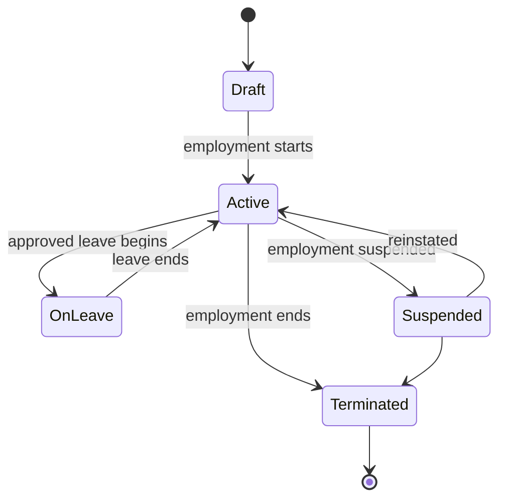
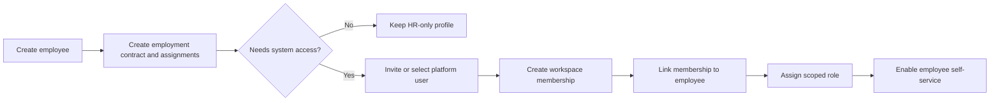

# Human resources

## Evidence

- **Observed** — employee creation includes name, contact data, job title, department, branch,
  contract type, salary, optional system user, manager, vacation balance, optional customer profile,
  and active state.
- **Observed** — leave requests require the signed-in membership to be linked to an employee.
- **Observed** — HR overview exposes employee count, requests/approvals, incidents, directory, payroll,
  performance, and incidents, while some detailed routes redirected or were empty.
- **Observed** — documents include employment certificate, bank letter, recommendation letter, and
  vacation evidence, with employee, issue date, and optional salary.
- **Observed** — payroll configuration exposes SFS, AFP, occupational-risk, and INFOTEP parameters.

## Actors and permissions

HR administrator, legal-entity manager, branch manager, employee, direct manager, leave approver,
payroll processor, document issuer, and auditor. Compensation, payroll, sensitive incidents, and
documents require permissions separate from directory access.

## Core rules

| Rule | Evidence | Behavior |
|---|---|---|
| HR-RULE-001 | Proposed | An employee is owned by one legal entity and may have time-bounded branch assignments. |
| HR-RULE-002 | Proposed | Platform identity, workspace membership, employee profile, and customer account are separate records with optional explicit links. |
| HR-RULE-003 | Proposed | A current employment relationship references an effective-dated contract, position, department, manager, compensation terms, and work assignments. |
| HR-RULE-004 | Proposed | Salary changes create new compensation versions; prior payroll and documents retain applied snapshots. |
| HR-RULE-005 | Proposed | Employee termination closes employment/assignments and access according to policy without deleting history. |
| HR-RULE-006 | Observed/Proposed | Employee self-service operations require an active employee-membership link in the same workspace. |
| HR-RULE-007 | Proposed | Leave entitlement is accrued and consumed through a ledger; a manually displayed balance is a projection. |
| HR-RULE-008 | Proposed | Leave approval verifies entitlement, dates, overlap, approver scope, and schedule impact. |
| HR-RULE-009 | Proposed | Payroll rules and employee inputs are effective-dated; a finalized payroll run is immutable and corrected by adjustment. |
| HR-RULE-010 | Proposed | Generated documents store template version, input snapshot, issuer, issue time, and integrity reference. |
| HR-RULE-011 | Proposed | Employee receivables reuse the shared receivable/allocation model and an explicit employee-customer link; HR must not maintain a second debt engine. |

## Employee lifecycle

## Employee-to-self-service flow

## Leave and payroll boundaries

- Leave requests and balances belong to HR; appointment scheduling consumes approved absence as
  availability evidence.
- Payroll calculation consumes effective employee, compensation, attendance/leave, commission, and
  regional-rule snapshots.
- Payroll payment and accounting posting are finance effects, not mutable fields on the employee.
- Sensitive payroll and incident data must use narrower access than the general employee directory.

## Entities and effects

`Employee`, `Employment`, `EmploymentContract`, `Position`, `Department`, `EmployeeAssignment`,
`ReportingLine`, `CompensationVersion`, `EmployeeMembershipLink`, `LeavePolicy`, `LeaveLedgerEntry`,
`LeaveRequest`, `PayrollRuleVersion`, `PayrollRun`, `PayrollResult`, `HRDocumentTemplate`, and
`GeneratedHRDocument`.

Effects: employee assignments constrain appointments and permissions; approved leave changes
availability; completed services feed commissions; payroll produces liabilities/payments and reports.

## Gaps

- Payroll, performance, and detailed HR incident routes were redirected or empty.
- Leave types, accrual formulas, approval chains, partial days, holidays, and cancellation rules were
  not visible.
- Contract history, termination, benefits, payroll periods, and payslips were not observable.
- The business meaning of linking an employee to a customer profile requires validation.

