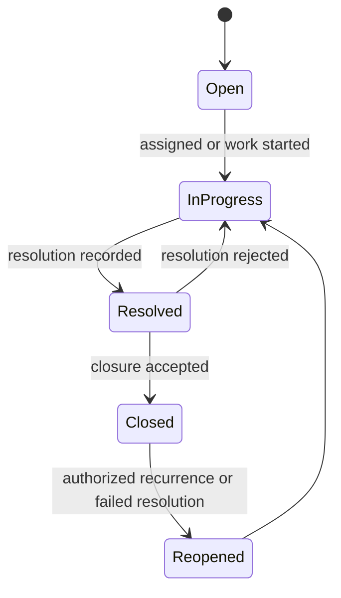
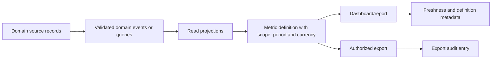

# Incidents and reports

## Evidence

- **Observed** — incident creation includes title, type, priority, affected branch, related asset,
  description, photo evidence, and multiple intervening users.
- **Observed** — incident lists expose code, title, reference, type, priority, assignees, and Open,
  In Progress, Resolved, and Closed states.
- **Observed** — reports include income/expense comparison, category breakdown, unified transaction
  history, memberships, appointments, inventory performance, branch/date filters, and freshness time.
- **Observed** — report export actions exist but were not used.

## Actors and permissions

Reporter, incident coordinator, assignee, resolver, closer, HR-sensitive incident viewer, report
viewer, and report exporter. Sensitive incident types and report row-level scope require independent
permissions.

## Core rules

| Rule | Evidence | Behavior |
|---|---|---|
| INC-RULE-001 | Proposed | An incident belongs to one workspace and may reference one branch, asset, employee, transaction, or other typed subject. |
| INC-RULE-002 | Proposed | Incident code is workspace-unique and assigned atomically. |
| INC-RULE-003 | Observed/Proposed | Type, priority, status, description, reporter, assignees, and evidence are explicit fields with history. |
| INC-RULE-004 | Proposed | Every state transition records actor, time, prior/new state, comment, and resolution metadata when required. |
| INC-RULE-005 | Proposed | Resolved means corrective action is complete; Closed means an authorized reviewer accepted closure. |
| INC-RULE-006 | Proposed | Reopening appends a transition and never erases the previous resolution. |
| INC-RULE-007 | Proposed | Attachment access follows incident sensitivity and workspace scope. |
| REPORT-RULE-001 | Proposed | Reports query source-of-truth domain records or documented projections; reports do not own duplicate transactions. |
| REPORT-RULE-002 | Proposed | Every report contract declares workspace/scope filters, branch time zone, period boundaries, currency, included states, aggregation, and freshness. |
| REPORT-RULE-003 | Proposed | Export requires the same row-level authorization as interactive viewing and creates an audit entry. |
| REPORT-RULE-004 | Proposed | Metric definitions are stable versioned contracts so dashboard and detail totals cannot silently diverge. |

## Incident lifecycle

## Reporting data flow

## Report families

- Commercial: pipeline, quotes, confirmed sales, sellers, customer purchases.
- Operational: appointments, service completion, carwash work orders, incidents.
- Inventory: balance, movement, availability, cost/estimated sale value, sold quantity.
- Finance: income/expense, budget, liability, account movement, cash reconciliation.
- HR: directory, leave, payroll, commissions, employee receivables, performance.
- SaaS/platform: subscription and workspace analytics; legacy implementation remained unverified.

## Entities and effects

`Incident`, `IncidentType`, `IncidentSubject`, `IncidentAssignment`, `IncidentStatusHistory`,
`IncidentResolution`, `Attachment`, `ReportDefinition`, `MetricDefinition`, `ReportRun`,
`ExportArtifact`, and domain-specific read projections.

## Gaps

- Incident SLA, escalation, notifications, deletion/retention, and sensitive HR segregation were not
  visible.
- Report formulas, return/refund treatment, time zones, exchange rates, and cache freshness were not
  fully defined.
- Membership reporting uses a legacy 30-day heuristic; see `GAP-010`.

