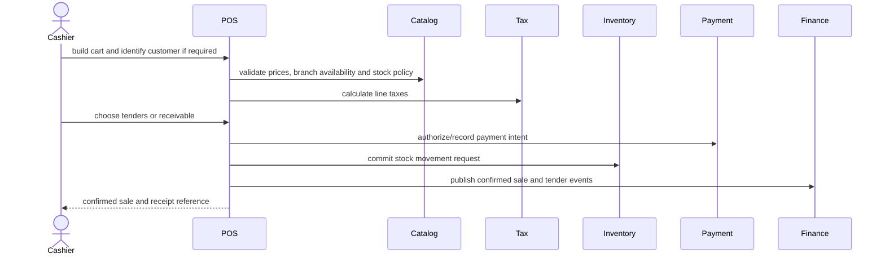
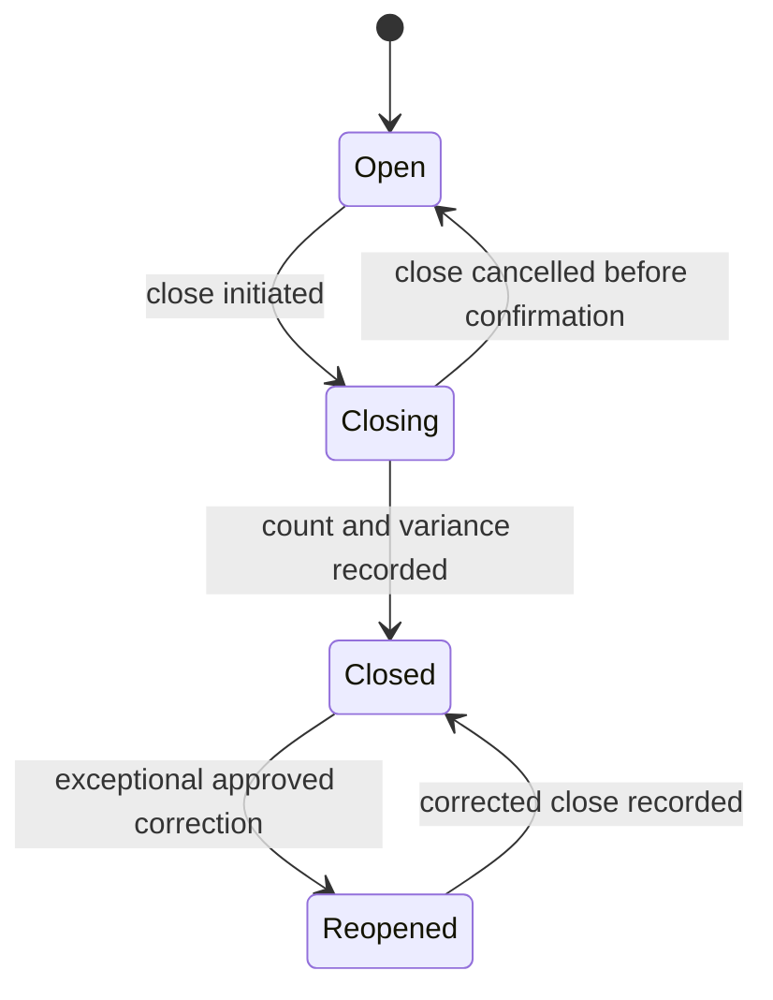

# POS, cash, and receivables

## Evidence

- **Observed** — `/pos` supports branch selection, catalog search, cart lines, walk-in customer,
  fixed/percentage discounts, item tax, fiscal credit, hold, split payment, cash, card, transfer,
  payment link, account receivable, print/download, and expense entry.
- **Observed** — `/pos/caja` exposes open/closed sessions, opening amount, expected cash, sales,
  income/expense movements, tender breakdown, close history, actual cash, difference, and state.
- **Observed** — `/pos/cuentas-por-cobrar` exposes charge total, paid, pending, due date, state, and
  actions.
- **Observed** — catalog configuration can permit dynamic prices and negative stock.

## Actors and permissions

Cashier, seller, branch manager, cash-session closer, discount approver, void/refund approver, and
collections clerk. High-risk permissions are separate: apply discount, override price, sell below
available stock, void sale, open/close session, register cash movement, and allocate receivable
payments.

## Core rules

| Rule | Evidence | Behavior |
|---|---|---|
| POS-RULE-001 | Proposed | A POS sale belongs to one branch and operating register and uses one transaction currency. |
| POS-RULE-002 | Proposed | Cart lines snapshot item name, unit, unit price, discount, tax rule/version, and fulfilled quantity. |
| POS-RULE-003 | Observed/Proposed | A sale can use a walk-in customer unless fiscal, credit, membership, or policy rules require an identified customer. |
| POS-RULE-004 | Proposed | Price override, discount, and negative-stock override require explicit permissions and audit reasons. |
| POS-RULE-005 | Proposed | Sale confirmation is idempotent and atomically records sale lines, payment/receivable intent, inventory effects, and fiscal intent. |
| POS-RULE-006 | Proposed | A payment is distinct from its tender; split payment creates several tender records whose accepted amounts cover the payable balance. |
| POS-RULE-007 | Proposed | Cash tender and cash movements require an active cash session for the branch/register/user policy. |
| POS-RULE-008 | Proposed | Expected cash equals opening cash plus accepted cash sales plus cash income movements minus cash refunds and cash expense movements. |
| POS-RULE-009 | Proposed | Closing records counted cash and calculated variance; it does not rewrite prior movements. |
| POS-RULE-010 | Proposed | A receivable is created only for an identified customer and authorized credit terms. |
| POS-RULE-011 | Proposed | Outstanding receivable equals charges minus valid allocations and never becomes negative; excess funds become unapplied customer credit or are rejected. |
| POS-RULE-012 | Proposed | Payment status is derived as Unpaid, Partial, Paid, Overdue, Voided, or WrittenOff from allocations, due dates, and lifecycle. |
| POS-RULE-013 | Proposed | Held carts expire by policy and do not affect inventory or finance unless reservations are explicitly enabled. |
| POS-RULE-014 | Proposed | Printing or downloading a receipt is a representation of an existing sale, never the event that confirms it. |

## POS sale sequence

## Cash-session lifecycle

`Reopened` is **Proposed** for controlled correction; the legacy UI did not reveal correction rules.

## Invariants and failure paths

- The workspace, legal entity, branch, register, cash session, sale, payment, and inventory location
  scopes must agree.
- A failed external card/link authorization cannot produce an accepted payment.
- Retrying confirmation with the same idempotency key returns the original result.
- Insufficient stock rejects the sale unless the item policy and actor permission both allow negative
  stock.
- Closing with a variance records the variance and approval trail; it never deletes movements.
- Voids and refunds create compensating records rather than editing confirmed sale/payment history.

## Entities and effects

`Register`, `CashSession`, `CashMovement`, `HeldCart`, `Sale`, `SaleLine`, `TenderType`, `Payment`,
`PaymentTender`, `PaymentAllocation`, `Receivable`, `ReceivableCharge`, `CustomerCredit`,
`FiscalDocument`, and `Receipt`.

Effects: sale confirmation changes inventory, finance projections, customer history, commissions,
membership entitlements, and reporting through explicit events.

## Gaps and anomalies

- **Gap** — exact authorization/settlement behavior for card, transfer, and payment-link tenders.
- **Gap** — refund, void, reopen, offline POS, and fiscal contingency flows.
- **Gap** — whether held carts reserve inventory.
- **Anomaly** — legacy receivable rows can display negative pending values; see `GAP-002` in
  [[gap-register]].

