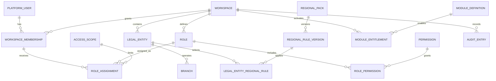
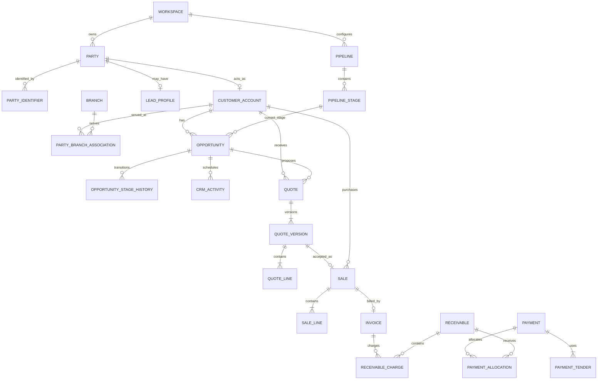
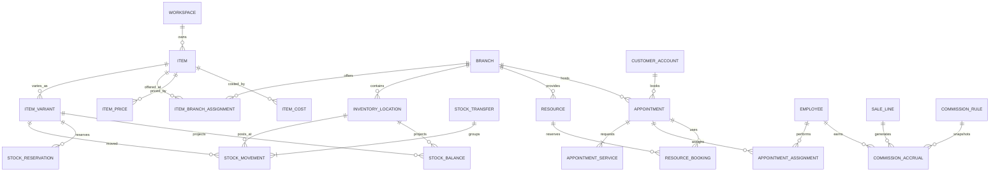
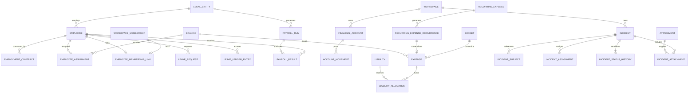
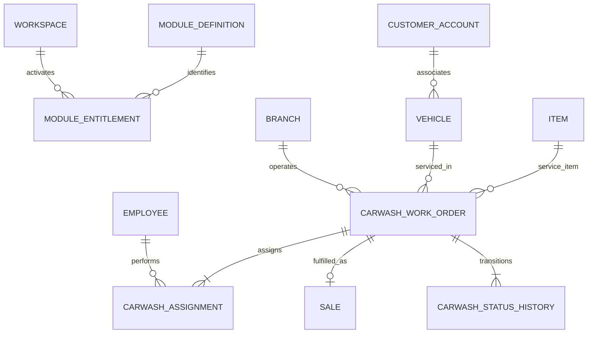

# Logical data model

This model describes aggregate ownership, relationships, and durable invariants. It intentionally
does not choose SQL types, table names, primary-key technology, indexes, or migration details.

## Isolation contract

- `Workspace` is the top-level data boundary.
- Every workspace-owned aggregate carries `workspace_id` directly, even when the workspace could be
  reached through another relation.
- A reference between workspace-owned records is valid only when both records share the same
  workspace.
- Legal-entity and branch references must also agree with their hierarchy.
- Platform-owned identities and module definitions are the only ordinary records without a
  workspace owner; access to business data still requires membership and scope evaluation.

## Foundation ERD

`AccessScope` points to exactly one workspace, legal entity, or branch and always belongs to the same
workspace as the membership and role assignment.

## Commercial ERD

`QuoteVersion -> Sale` is optional and idempotent. Manual/POS sales do not require a quote.

## Operations ERD

`StockBalance` is a projection of posted movements and is not independently editable.

## HR, finance, and incidents ERD

## Optional-package extension ERD

Unverified packages must add their own ERD only after passing the discovery gate in
[[unverified-verticals]].

## Aggregate and transaction boundaries

| Aggregate | Owns atomic decisions | Does not own |
|---|---|---|
| Workspace | lifecycle, configuration roots, entitlement references | user authentication credentials, business transactions |
| Membership/role assignment | workspace access and scope | employee lifecycle |
| Opportunity | stage and activity relationship | quote versions, sale/payment truth |
| Quote | version sequence and quote lifecycle | confirmed sale inventory/payment effects |
| Sale | confirmed line/price/tax snapshot | external tender settlement, stock balance |
| Payment | tender attempts and allocations | invoice/sale content |
| Cash session | opening/closing and cash movements | non-cash settlement |
| Item | catalog identity and policies | inventory quantity |
| Stock movement/transfer | immutable quantity change | mutable catalog definition |
| Appointment | schedule, assignments, outcome | sale/payment and commission payout |
| Employee/employment | HR relationship and effective terms | authentication and financial account movements |
| Expense/liability/account | each aggregate's operational ledger | full accounting journal until the optional accounting package exists |
| Incident | incident lifecycle and evidence links | mutation of referenced domain resources |
| Carwash work order | vertical operational lifecycle | duplicated customer, employee, sale, or payment truth |

## Common logical attributes

Every workspace-owned aggregate root includes logical identity, `workspace_id`, lifecycle/version,
created/updated timestamps, and audit actor/correlation context. Legal-entity and branch scope is
included where ownership or reporting requires it. Money always includes currency; time intervals
include a time-zone interpretation; configurable rules carry effective dates and version references.

Related: [[data-dictionary]], [[database-handoff]], [[cross-domain-flows]].

