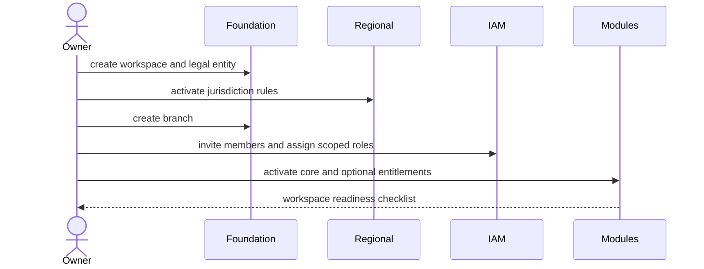
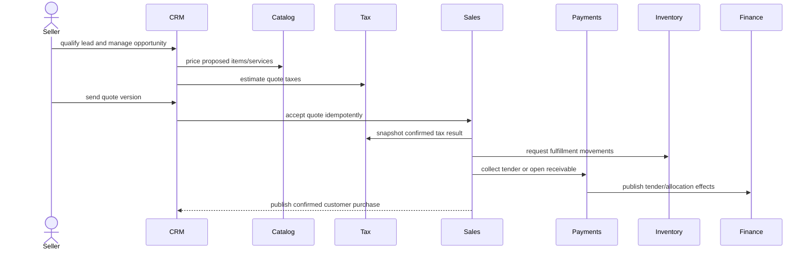
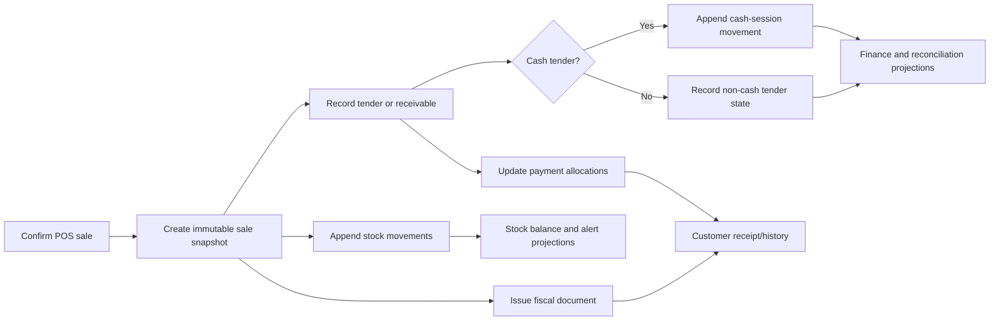
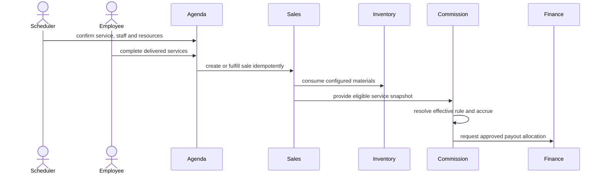
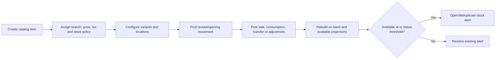
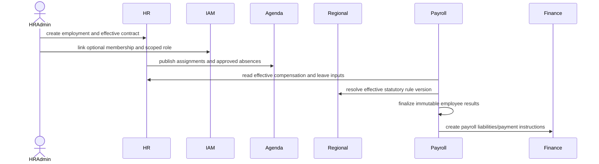
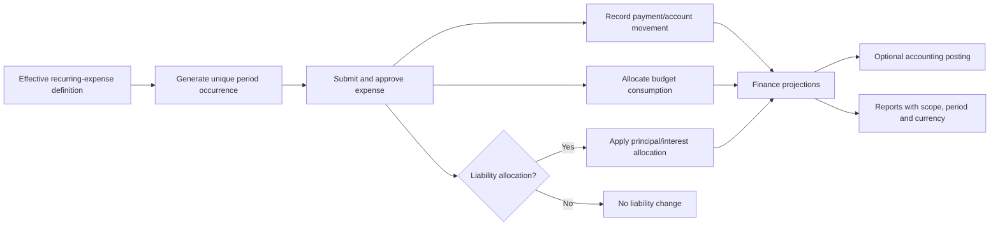
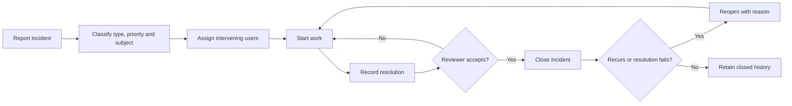
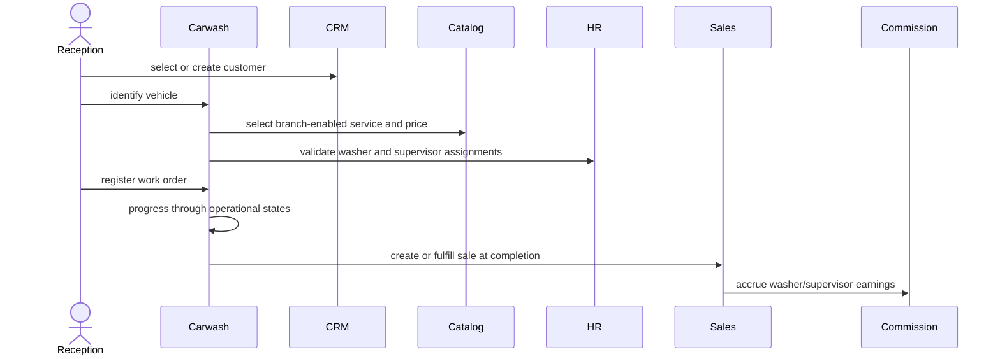

# Cross-domain flows

These diagrams describe domain ownership and required effects. They do not prescribe synchronous
HTTP calls, message brokers, or microservices. The replacement starts as a modular monolith; domain
events may initially be handled in-process within the same transaction or by a durable post-commit
worker when external effects require it.

## FLOW-001 — Workspace onboarding

Source of truth: foundation and IAM. See the complete flow in [[saas-foundation]].

Invariant: no operational command is accepted until the relevant legal entity, branch, entitlement,
regional configuration, membership, permission, and scope are active.

## FLOW-002 — Lead to receivable/payment

Source of truth: CRM for opportunity/quote, Sales for sale/invoice, Payments for money allocation.

Failure rules: quote acceptance retry returns the original sale; payment failure does not mark the
invoice paid; inventory failure follows an explicit reservation/negative-stock policy rather than
silently losing a movement.

## FLOW-003 — POS sale to operational ledgers

Source of truth: Sales/POS, Payments, Cash, Inventory, and Finance each own their respective records.

Invariant: failures cannot leave a confirmed sale without a recorded payment/receivable decision and
inventory/fiscal intents. External settlement may remain pending, but its state is explicit.

## FLOW-004 — Appointment to commission

Source of truth: Agenda owns the schedule, Sales owns the charge, Commissions owns earnings.

Invariant: changing the current commission rule does not recalculate historical accruals.

## FLOW-005 — Catalog to stock alert

Source of truth: Catalog owns definitions/policies; Inventory owns quantities.

Invariant: no command writes an arbitrary stock balance; all changes append a movement.

## FLOW-006 — Employee to payroll/document/self-service

Source of truth: HR owns employment; IAM owns access; regional pack owns statutory rules.

Invariant: terminating employment and revoking workspace membership are coordinated but separate
commands with independent audit histories.

## FLOW-007 — Recurring expense to reporting

Source of truth: Finance; optional Accounting consumes approved events.

Invariant: the occurrence uniqueness key prevents duplicate monthly expenses after retries.

## FLOW-008 — Incident resolution

Source of truth: Incidents; referenced domains retain ownership of their resources.

Invariant: closure does not mutate the referenced asset, employee, or transaction unless an
authorized command in that owning domain is executed.

## FLOW-009 — Carwash work order

Source of truth: Carwash owns the work order while core domains own shared records.

## Domain event catalog

| Event | Producer | Primary consumers |
|---|---|---|
| `WorkspaceActivated` | Foundation | IAM, module entitlements, onboarding projection |
| `MembershipRevoked` | IAM | Session/access cache, audit, employee self-service |
| `QuoteAccepted` | CRM | Sales |
| `SaleConfirmed` | Sales/POS | Inventory, finance, CRM history, commissions, reporting |
| `PaymentAccepted` | Payments | Receivables, cash session, finance, reporting |
| `PaymentReversed` | Payments | Receivables, cash session, finance, reporting |
| `StockMovementPosted` | Inventory | Stock balances, alerts, reporting |
| `AppointmentCompleted` | Agenda | Sales, commissions, employee performance |
| `LeaveApproved` | HR | Agenda availability, payroll |
| `PayrollFinalized` | HR/Payroll | Finance, documents, optional accounting |
| `ExpenseApproved` | Finance | Budget, liability suggestion, optional accounting |
| `IncidentClosed` | Incidents | Reporting and subject-domain notification only |
| `CarwashWorkOrderCompleted` | Carwash | Sales, commissions, reporting |

Events include aggregate ID, workspace ID, occurred-at UTC timestamp, actor/correlation context,
aggregate version, and event schema version. Sensitive payloads use references rather than copying
personal or clinical data.

