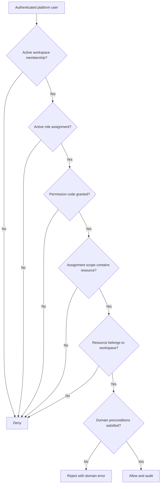
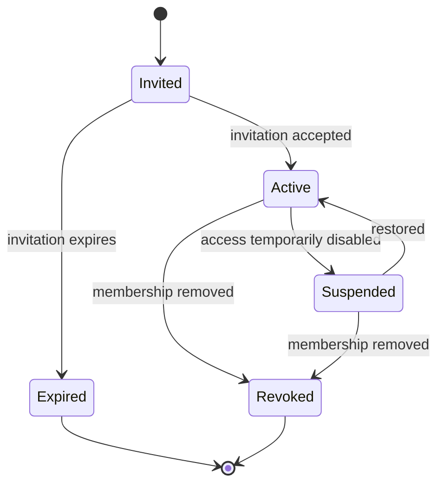

# Access control

## Evidence and intent

- **Observed** — `/configuracion/permisos` exposes module/action permissions for Administrator,
  Manager, Supervisor, Cashier, and Seller roles.
- **Observed** — `/configuracion/usuarios` assigns one role and multiple permitted branches to a
  user.
- **Observed** — the employee form can optionally link an employee to a system user.
- **Proposed** — role names become editable starter templates and access is granted through scoped
  role assignments on a workspace membership.

## Actors

Platform user, workspace owner, workspace administrator, role administrator, legal-entity manager,
branch manager, employee self-service user, and service account.

## Core rules

| Rule | Evidence | Behavior |
|---|---|---|
| IAM-RULE-001 | Proposed | Authentication proves a platform identity; it grants no workspace access by itself. |
| IAM-RULE-002 | Proposed | Workspace access requires an active membership. |
| IAM-RULE-003 | Proposed | Permissions are stable action codes such as `sale.create` or `cash_session.close`, not UI labels. |
| IAM-RULE-004 | Proposed | A role is a workspace-owned set of permission codes; starter roles may be cloned and edited. |
| IAM-RULE-005 | Proposed | A role assignment has a scope of workspace, legal entity, or branch. |
| IAM-RULE-006 | Proposed | A request is allowed only when membership, role assignment, permission, scope, resource ownership, and domain preconditions all pass. |
| IAM-RULE-007 | Proposed | Deny-by-default applies to new modules and permission codes. |
| IAM-RULE-008 | Proposed | A user cannot grant a permission or scope that the acting user is not authorized to administer. |
| IAM-RULE-009 | Proposed | Removing a membership revokes workspace access but does not delete the platform identity, employee record, or authored audit history. |
| IAM-RULE-010 | Proposed | Employee self-service requires an active employee-to-membership link for the same workspace. |
| IAM-RULE-011 | Proposed | Platform support access is time-bounded, explicitly approved, separately audited, and excluded from ordinary workspace roles. |
| IAM-RULE-012 | Proposed | Authorization is enforced server-side; hidden navigation is never sufficient protection. |

## Authorization evaluation

## Membership lifecycle

## Permission families

- Foundation: workspace, legal entity, branch, membership, role, setting, entitlement.
- CRM/sales: party, customer, opportunity, quote, invoice, payment, export.
- POS: sell, discount, void, cash session, cash movement, receivable.
- Agenda: view, create, reschedule, cancel, complete, resource configuration.
- HR: directory, employee, compensation, leave, payroll, documents.
- Finance: income, expense, budget, liability, financial account, reporting.
- Inventory: item, price, stock receipt, issue, transfer, adjustment, negative-stock override.
- Incidents: create, assign, transition, close, view sensitive incident types.
- Optional packages: entitlement-specific action codes.

## Failure behavior

- Missing/invalid authentication -> `401` at the future API boundary.
- Active identity without workspace membership -> `403`.
- Permission or scope denial -> `403` without revealing inaccessible resource existence.
- Resource identifier outside workspace -> `404` or policy-consistent `403`; choose one globally in
  the future API contract.
- Stale role or membership version -> reject and require authorization refresh.

## Entities

`PlatformUser`, `WorkspaceMembership`, `Role`, `Permission`, `RolePermission`, `RoleAssignment`,
`AccessScope`, `EmployeeMembershipLink`, `ServiceAccount`, and `SupportAccessGrant`.

## Gaps

- **Gap** — the legacy UI does not prove whether permissions are enforced server-side.
- **Gap** — permission precedence and multiple-role behavior were not observable.
- **Gap** — multi-factor authentication, invitation expiration, and support access were not visible.

Related: [[saas-foundation]], [[human-resources]], [[data-dictionary]].

