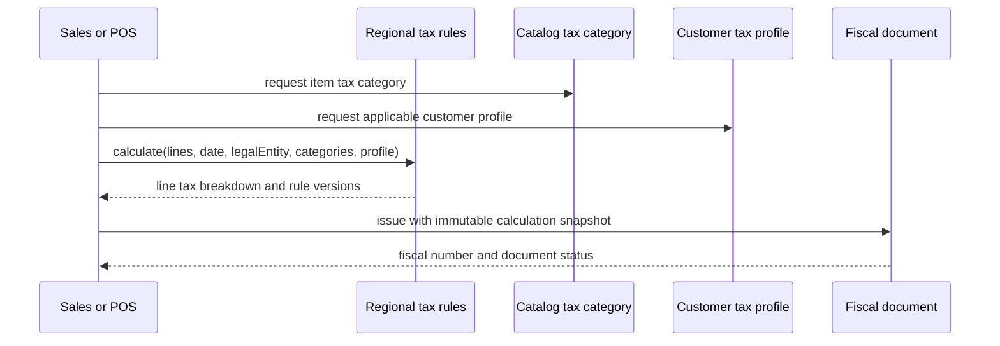

# Dominican Republic regional pack

## Evidence and boundary

- **Observed** — POS and quote screens expose ITBIS at 18%; POS also states that tax is calculated
  by item configuration.
- **Observed** — branch and quote forms expose RNC or national-identity fields.
- **Observed** — sales expose fiscal-document information.
- **Observed** — payroll configuration exposes employer/employee values for SFS, AFP, occupational
  risk, and INFOTEP.
- **Observed** — regional configuration offers DOP and USD display choices.
- **Proposed** — these rules belong to a versioned legal-entity regional pack, not the core sale,
  employee, or item entities.

This note is a software domain model, not legal or tax advice. Rates, document sequences, and filing
requirements require validation against current authoritative rules before implementation.

## Core rules

| Rule | Evidence | Behavior |
|---|---|---|
| DR-RULE-001 | Proposed | A legal entity activates one jurisdiction pack for a defined effective period. |
| DR-RULE-002 | Proposed | Tax rules are versioned with effective dates and may apply by item tax category, customer status, document type, and transaction date. |
| DR-RULE-003 | Proposed | Quotes estimate tax through the same rule service used by confirmed sales; the applied sale/invoice rule is snapshotted. |
| DR-RULE-004 | Proposed | RNC and other identifiers are typed, validated identifiers owned by a party or legal entity, not generic text duplicated across documents. |
| DR-RULE-005 | Proposed | Fiscal document numbering is legal-entity scoped and branch/register scoped only when required by the configured sequence. |
| DR-RULE-006 | Proposed | Issued fiscal documents are corrected with explicit cancellation, credit-note, or replacement flows; they are not silently edited. |
| DR-RULE-007 | Proposed | Payroll contribution rules are versioned by effective date and snapshotted on each payroll calculation. |
| DR-RULE-008 | Proposed | A workspace display currency does not re-denominate stored transactions. Each money amount retains its currency. |
| DR-RULE-009 | Proposed | Exchange rates, when introduced, include source, quotation convention, and effective timestamp. |

## Tax calculation flow

## Configuration groups

- Legal-entity taxpayer identity and registered name.
- Fiscal document types, sequences, expiration/effective rules, and branch/register assignments.
- Item tax categories, exemptions, and inclusive/exclusive price behavior.
- Payroll earnings/deduction bases and employer/employee contribution rates.
- Default operating currency, supported transaction currencies, and formatting locale.
- Required legal document templates and retention metadata.

## Entities

`RegionalPack`, `RegionalRuleVersion`, `TaxCategory`, `TaxRule`, `TaxCalculationSnapshot`,
`PartyIdentifier`, `FiscalDocumentType`, `FiscalSequence`, `FiscalDocument`,
`PayrollRuleVersion`, `Money`, and `ExchangeRate`.

## Gaps

- **Gap** — exact fiscal document types, numbering ownership, expiration, cancellation, and offline
  rules were not observable.
- **Gap** — whether displayed prices are tax-inclusive depends on product and legal requirements.
- **Gap** — payroll calculation bases, caps, exemptions, and filing outputs were not observed.
- **Gap** — multi-currency accounting versus display-only currency was not implemented coherently in
  the observed UI.

Related: [[crm-and-sales]], [[pos-cash-and-receivables]], [[human-resources]], [[finance]].

