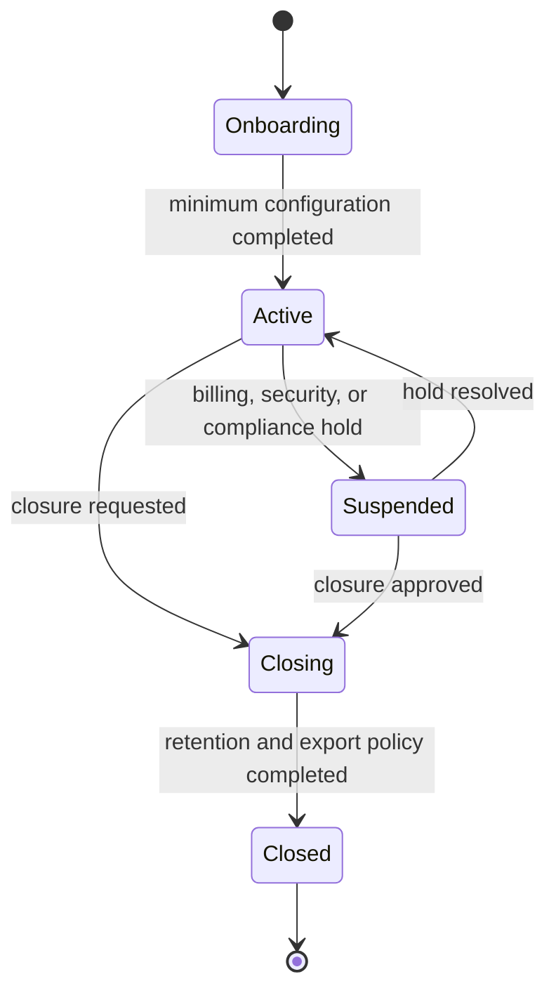

# SaaS foundation

## Evidence and intent

- **Observed** — `/configuracion/sucursales` exposes branch-level identity, contact, fiscal, manager,
  and partner information.
- **Observed** — users can be limited to selected branches and permissions are organized by module
  and action.
- **Observed** — `/configuracion/region` describes settings as applying to every user in the legacy
  tenant.
- **Inferred** — `/super-admin` and `/super-admin/tenants/:tenantId` indicate a platform-level
  administration boundary, but they were not accessible.
- **Proposed** — replace the overloaded legacy tenant/branch concepts with `Workspace`,
  `LegalEntity`, and `Branch`.

## Actors and permissions

| Actor | Responsibilities |
|---|---|
| Platform operator | Manage SaaS plans, platform status, support access, and workspace lifecycle without entering ordinary business records. |
| Workspace owner | Accept the subscription, create legal entities, assign workspace administrators, and manage module entitlements. |
| Workspace administrator | Configure workspace defaults, legal entities, branches, roles, and regional packs. |
| Legal-entity administrator | Configure fiscal identity and branches for assigned legal entities. |
| Branch manager | Operate within explicitly assigned branches. |

## Core rules

| Rule | Evidence | Behavior |
|---|---|---|
| FOUNDATION-RULE-001 | Proposed | Every business aggregate belongs to exactly one workspace. |
| FOUNDATION-RULE-002 | Proposed | A legal entity belongs to one workspace; a branch belongs to one legal entity. |
| FOUNDATION-RULE-003 | Proposed | A workspace may contain multiple legal entities and each legal entity may contain multiple branches. |
| FOUNDATION-RULE-004 | Proposed | Cross-workspace references are invalid even when referenced identifiers exist. |
| FOUNDATION-RULE-005 | Proposed | Workspace suspension blocks new business writes but preserves authorized read/export and platform recovery paths defined by policy. |
| FOUNDATION-RULE-006 | Proposed | Module activation is represented by an entitlement with lifecycle and effective dates, not by the presence of UI routes. |
| FOUNDATION-RULE-007 | Proposed | Disabling a module hides new operations but does not delete or orphan historical records. |
| FOUNDATION-RULE-008 | Proposed | Legal-entity fiscal identity and branch operating identity are independently versioned. |
| FOUNDATION-RULE-009 | Proposed | Configuration inheritance is explicit: platform default -> workspace override -> legal-entity override -> branch override, only for settings that declare those levels. |
| FOUNDATION-RULE-010 | Proposed | Platform operators and workspace members use separate authorization contexts and audit categories. |

## Workspace onboarding

### Preconditions

- The owner has a verified platform identity.
- A valid subscription or trial policy exists.
- Workspace slug/name uniqueness is evaluated within the platform namespace.

### Alternate paths

- Onboarding can stop after any step and resume without creating partial business transactions.
- A workspace may add another legal entity later without duplicating users or workspace roles.
- A legal entity may start without a branch only while onboarding is incomplete.

## Lifecycle

The lifecycle is **Proposed**. Exact billing grace periods and legal retention requirements remain
outside the observed evidence.

## Configuration ownership

| Configuration | Owner |
|---|---|
| Subscription and module entitlements | Workspace |
| Default locale, time zone, and reporting currency | Workspace |
| Fiscal identity, statutory numbering, payroll jurisdiction | Legal entity |
| Address, schedule, registers, cabins, local inventory locations | Branch |
| User display preferences | Platform user or membership, never the workspace's financial truth |

## Invariants and cross-domain effects

- Archiving a legal entity or branch prevents new operations but preserves historical references.
- Moving a branch between legal entities is not supported as a simple edit; it requires a controlled
  migration because fiscal documents, employees, inventory, and accounts may belong to the former
  entity.
- Every domain event carries `workspace_id`; events owned by a legal entity or branch also carry the
  applicable scope identifiers.
- Time-dependent rules use the branch time zone for operations and UTC timestamps for durable
  ordering.

## Entities

`Workspace`, `WorkspaceSetting`, `LegalEntity`, `LegalEntityIdentity`, `Branch`, `BranchSetting`,
`ModuleDefinition`, `ModuleEntitlement`, `RegionalPack`, `SubscriptionAccount`, and `AuditEntry`.

## Gaps

- **Gap** — legacy workspace subscription, suspension, and data-retention behavior was not
  accessible.
- **Gap** — ownership and partner information shown on branch cards may represent shareholders,
  investors, or simple notes; it must not be copied into the branch aggregate without validation.

Related: [[access-control]], [[dominican-republic-pack]], [[logical-data-model]].

