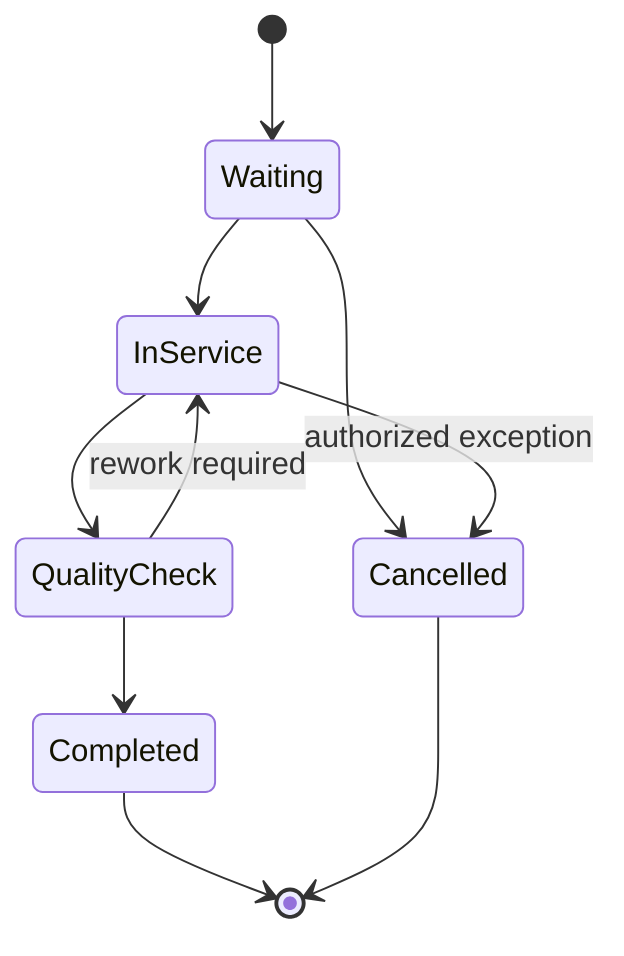

# Carwash package

## Evidence

- **Observed** — `/carwash` is branch-scoped and exposes active/waiting services, completed services,
  daily income, pending commissions, operational and reporting tabs, and work-order state filters.
- **Observed** — the blank work-order form includes existing/quick customer, plate, make/model, color,
  wash service, assigned washer, supervisor, and payment method.
- **Observed** — table columns include date/time, customer/vehicle, service, washer, supervisor,
  price/payment, state, and operational actions.
- **Observed** — account receivable is an available payment choice.

## Package boundary

Carwash is an optional workspace entitlement. It owns vehicle service work orders and operational
state, but reuses core `Party/CustomerAccount`, `Item` services, `Employee`, `Appointment`, `Sale`,
`Payment/Receivable`, `CommissionAccrual`, `Branch`, and reporting contracts.

## Actors and permissions

Receptionist, washer, supervisor, cashier, branch manager, commission administrator, and customer.
Permissions separate work-order creation, assignment, transition, cancellation, price override,
payment, and reporting.

## Core rules

| Rule | Evidence | Behavior |
|---|---|---|
| CARWASH-RULE-001 | Proposed | A work order belongs to one workspace and branch and references one customer, vehicle, service item, assigned washer, and supervisor. |
| CARWASH-RULE-002 | Proposed | A vehicle is workspace-owned by identity and may be associated with several customer accounts over time; plate uniqueness follows jurisdiction/workspace policy. |
| CARWASH-RULE-003 | Proposed | The selected service is a core catalog item enabled for the branch; applied price and commission inputs are snapshotted. |
| CARWASH-RULE-004 | Proposed | Only authorized transitions are allowed and every transition is historical/audited. |
| CARWASH-RULE-005 | Proposed | Completion records delivered service, responsible employees, completion time, and condition/notes when required. |
| CARWASH-RULE-006 | Proposed | Completion creates or fulfills a core sale idempotently; work-order payment labels are projections of core payments/receivables. |
| CARWASH-RULE-007 | Proposed | Commissions are core accruals derived from the completed service and snapshotted rules. |
| CARWASH-RULE-008 | Proposed | Cancellation after payment or service start requires explicit refund/reversal and reason policies. |

## Operational flow

```mermaid
flowchart LR
    A[Identify or create customer] --> B[Identify vehicle]
    B --> C[Select branch-enabled wash service]
    C --> D[Assign washer and supervisor]
    D --> E[Choose payment or authorized credit]
    E --> F[Register waiting work order]
    F --> G[Start service]
    G --> H[Complete and verify service]
    H --> I[Create or fulfill sale]
    I --> J[Record payment/receivable]
    J --> K[Accrue commissions]
    K --> L[Update operations and reports]
```

## Proposed lifecycle

The complete legacy state set was not visible; this lifecycle is **Proposed**.

## Entities and effects

`Vehicle`, `VehicleCustomerAssociation`, `CarwashWorkOrder`, `CarwashAssignment`,
`CarwashStatusHistory`, and `CarwashQualityCheck` are package-owned. All monetary, employee,
catalog, inventory-consumption, document, and commission records remain core entities.

## Gaps

- Service state enum, queue priority, rework, damage evidence, cancellation, and capacity rules.
- Whether payment occurs before registration, before completion, or at delivery.
- Service recipes and consumable inventory behavior.
- Washer/supervisor commission split and payout policy.

